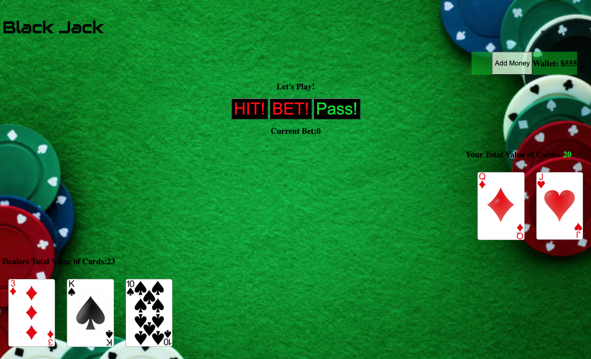

# BlackJack

[Play Here](https://basebenjamin13.github.io/Blackjack/)

BlackJack is a poker game usaully played at casinos. The goal of blackjack is to get 21 but if you over 21 you lose, you can win by getting closer to 21 then the dealer.

How To Play: To start the game click the bet button and place a bet, you will get 2 cards, if you want an aditional card click the Hit button, you can do that up to 10 times. When your ready and happy with your cards click the pass button. After clicking the pass button the dealer with gets cards untill he beats your cards or goes over 21 resulting in your victory. If you lose you will lose your bet, however if you win you'll get 2x your bet back into your wallet. Run out of money? Just click the 'add money' button and enter the desired amount.

------------------

### Screenshot: 

Hint: the hit, bet, pass buttons and total value of cards number will change collor based on if its a good bet.
Red: Bad Bet;
Yellow: Might work;
Green: Good Bet;